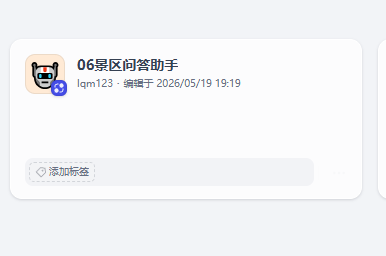
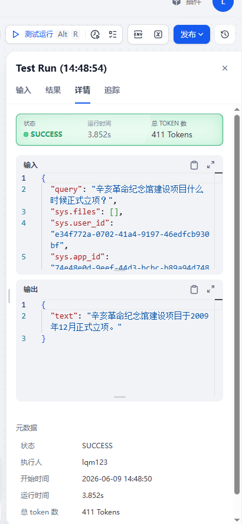

# 06 景区问答助手 Dify 工作流

这是一个基于 Dify Workflow 构建的景区智能问答助手 DSL 项目。工作流面向游客咨询场景，支持问候、感谢、转人工、告别等基础意图识别，并结合知识库检索与大模型回答景区相关问题。

## 项目文件

```text
.
├── README.md
├── scenic-qa-assistant.yml      # Dify 工作流 DSL 文件
└── assets/                      # 项目截图、工作流截图、效果图存放位置
```

## 工作流简介

工作流名称：`06景区问答助手`

工作流模式：`workflow`

主要能力：

- 识别用户输入意图：问候、感谢、告别、人工客服、景区咨询。
- 对固定意图直接返回预设回复。
- 对景区咨询问题进入知识库检索流程。
- 检索到知识内容时，调用大模型基于 RAG 内容回答。
- 未检索到内容时，调用常规大模型提示词进行兜底回复。
- 限制回答范围，避免编造景区专业信息。

## 工作流结构

核心节点包括：

1. 用户输入
2. 意图识别 Python 代码节点
3. 条件分支节点
4. 知识检索节点
5. RAG 大模型回答节点
6. 常规兜底大模型回答节点
7. 输出节点

## DSL 导入方式

1. 打开 Dify 控制台。
2. 进入应用列表页面。
3. 选择“导入 DSL 文件”或创建应用时选择从 DSL 导入。
4. 上传本仓库中的 `scenic-qa-assistant.yml`。
5. 根据本地环境重新配置模型供应商、知识库、API Key 等信息。
6. 保存并测试工作流。

> 注意：DSL 中不包含密钥。导入后需要在 Dify 中重新配置对应的大模型和知识库资源。

## 图片展示

请将项目截图放到 `assets/` 目录，然后替换下面的图片路径。

### 应用首页截图



### 工作流编排截图



### 问答效果截图


## 适用场景

- 景区智能客服
- 展馆/纪念馆问答助手
- 文旅咨询机器人
- 基于知识库的 RAG 问答演示
- Dify Workflow 学习与复用

## 运行环境建议

- Dify 版本：建议使用与导出环境接近的版本，例如 Dify `1.14.x`
- 模型供应商：通义千问 / DashScope 兼容模型
- Rerank 模型：`qwen3-rerank`
- Chat 模型：`qwen3-max` 或同等能力模型

## 说明

本项目仅包含 Dify 工作流 DSL 和说明文档，不包含知识库原始数据、模型 API Key 或其他敏感配置。
